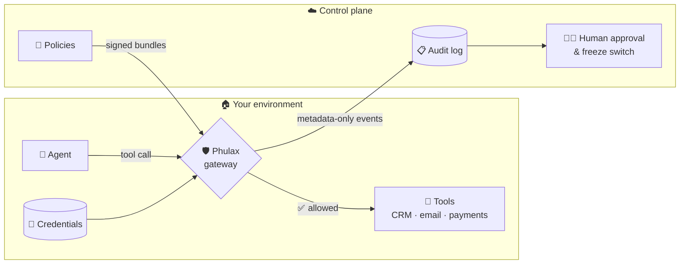

<div align="center">

# 🛡️ Phulax

**The runtime security gateway for AI agents.**

Agents act. Phulax decides — allow, block, or hold for a human.
Every decision leaves an audit event. One switch freezes everything.
Your credentials and your data never leave your environment.

[](https://github.com/phulax-io/phulax/actions/workflows/ci.yml)
[](LICENSE)
[](pyproject.toml)
[](#status--roadmap)
[](https://docs.astral.sh/ruff/)
[](CONTRIBUTING.md)

[Why](#why-phulax) •
[How it works](#how-it-works) •
[Quickstart](#quickstart) •
[Status](#status--roadmap) •
[Docs](#documentation) •
[Contributing](#contributing)

</div>

---

## Why Phulax

You shipped an agent that can *act* — issue refunds, send email, touch the
CRM, modify infrastructure. Now every capability grant is a negotiation with
your own fear, because today's options are all bad:

- 🔑 **Hand the agent raw API keys** and hope the prompt holds.
- 🍝 **Wrap every tool in bespoke if-statements** that nobody reviews and
  nothing audits.
- 🛑 **Stall the rollout** and watch the roadmap slip.

And when something odd happens, your "audit trail" is a grep through LLM
logs full of customer data.

**Phulax is the fourth option:** one gate, in *your* environment, that every
consequential action passes through.

## How it works

The open-source **gateway** runs inside your network and enforces policy on
every agent tool call. The hosted **control plane** is where your team
authors policies, approves held actions, and reviews the audit trail — it
receives *metadata only*, never raw content, never credentials.



Four load-bearing bets, each written down as an ADR before any code:

| Bet | Why | Decision record |
|-----|-----|-----------------|
| 🏠 **Local enforcement** | Your credentials and traffic never route through our cloud | [ADR-0001](docs/decisions/ADR-0001-local-gateway-hosted-control-plane.md) |
| 📋 **Metadata-first audit** | We can't leak what we never store — raw content capture is off by default | [ADR-0002](docs/decisions/ADR-0002-metadata-first-logging.md) |
| ⚖️ **Deterministic policy** | Same call, same policy, same verdict — every block cites its rule | [ADR-0003](docs/decisions/ADR-0003-deterministic-policy-engine-first.md) |
| 🧊 **Human in the loop** | Dangerous actions hold for approval; one switch freezes an agent | [Threat model](docs/security/threat-model.md) |

### What a decision event will look like

<sup>*Design preview — this is the schema the build is walking toward, not a shipped API.*</sup>

```jsonc
{
  "event": "decision",
  "agent": "refund-agent",
  "tool": "payments.refund",
  "verdict": "hold",                       // allow | block | hold
  "rule": "refunds.max-amount-exceeded",   // every verdict cites its rule
  "policy_version": "2026-08-11.3",
  "args_hash": "sha256:9f2c…",             // correlate without storing content
  "args_meta": { "amount": "number", "recipient": "string" },
  "raw_content": null                      // off by default, forever auditable
}
```

## Quickstart

Requires [uv](https://docs.astral.sh/uv/) and Docker.

```bash
git clone https://github.com/phulax-io/phulax.git && cd phulax
cp .env.example .env
make bootstrap   # venv + locked dependencies + git hooks
make test        # smoke test — green from a clean clone
make dev         # local services (Day 0: postgres + redis)
```

Every phase of the build honors the same six-verb contract (`make help`):

| Verb | Does |
|------|------|
| `make bootstrap` | venvs + locked dependencies + pre-commit hooks |
| `make dev` | postgres, redis *(later: api, web, local gateway)* |
| `make migrate` | apply schema *(Day 0 stub)* |
| `make seed` | demo org, agent, tools, policies *(Day 0 stub)* |
| `make test` | unit + integration tests |
| `make demo` | one safe tool call through the gateway *(Day 0 stub)* |

If `make bootstrap && make test` fails on a clean clone, that's a bug —
[open an issue](https://github.com/phulax-io/phulax/issues).

## Status & roadmap

Built in public, one honest phase at a time:

- [x] **Day 0 — evidence system & workspace**: reproducible env, threat
      model (15 threats), data inventory, 3 ADRs, CI + secret scanning
- [ ] **Gateway v1**: an authenticated agent call reaches the gateway and
      produces a structured decision event
- [ ] **Policy engine**: deterministic allow / block / hold verdicts,
      table-driven-tested, every verdict citing its rule
- [ ] **Approvals & freeze**: human-in-the-loop for held actions, one-switch
      agent freeze
- [ ] **The demo**: a refund agent with CRM, email, and simulated payments —
      a malicious ticket gets held, denied, frozen, and re-blocked
      ([the acceptance test](docs/first-demo.md))
- [ ] **Hosted control plane**: policy authoring, approval queue, audit views

## Documentation

| Read this | To learn |
|-----------|----------|
| [Founder thesis](docs/thesis.md) | Who this is for — and what we refuse to build |
| [ADRs & decision log](docs/decisions/) | Why the architecture is what it is, with receipts |
| [Threat model](docs/security/threat-model.md) | The 15 threats, the data-flow diagram, the data inventory |
| [Protected-action DoD](docs/security/protected-action-dod.md) | The seven-point bar every dangerous action must clear |
| [Security backlog](docs/security/backlog.md) | What's hardened now vs. scheduled |

## Repository layout

```
apps/
  gateway/   🛡️  local enforcement point (runs in YOUR environment)
  api/       ☁️  hosted control plane API
  web/       📊  control plane dashboard (placeholder)
docs/
  decisions/ 📜  ADRs + decision log — why things are the way they are
  evidence/  🔬  assumptions register + interview log (real data stays private)
  security/  🔒  threat model, data inventory, backlog, definitions of done
```

## Contributing

Contributions are welcome — the most valuable ones right now are bug
reports, threat-model review, and small, well-tested fixes.

- 📖 [CONTRIBUTING.md](CONTRIBUTING.md) — setup, style, PR process
- 🤝 [Code of Conduct](CODE_OF_CONDUCT.md) — community standards
- 🔒 [SECURITY.md](SECURITY.md) — **never** open a public issue for a
  vulnerability; report privately to **security@phulax.io**

## License

[Apache License 2.0](LICENSE) — free to use, fork, and build on.

---

<div align="center">
<sub>Phulax (φύλαξ) — Greek for <i>guardian</i>. Built in the open, one verified phase at a time.</sub>
</div>
