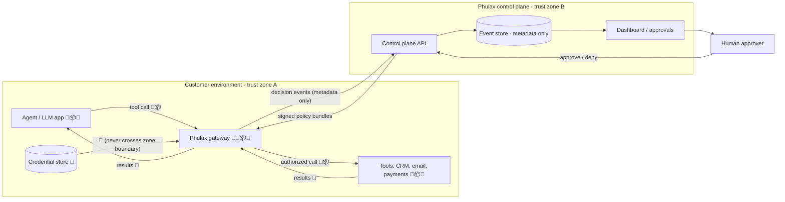

# Threat model (skeleton)

**Status:** Day-0 skeleton (plan §4.3). One row per threat; each gets a full
write-up as the component it touches is built. IDs are stable — backlog
items, tests, and ADRs reference them.

## System in one paragraph

Agents call tools *through* the Phulax gateway, which runs inside the
customer environment (ADR-0001). A deterministic policy engine (ADR-0003)
returns a verdict — allow, block, or require-approval — and every decision is
recorded as a metadata-first event (ADR-0002) shipped to the hosted control
plane, where humans author policies, approve held actions, and review audit
trails. Tool credentials live only on the gateway side.

## Data-flow diagram

Markers: 🔑 credentials · 💬 prompts · 📦 arguments · 📄 results

Everywhere 🔑💬📦📄 appear inside zone A, they may exist **in memory** on the
gateway. They must never appear in zone B storage unless raw capture is
explicitly enabled and redaction has run (ADR-0002).

## The 15 threats

| ID | Threat | Category | Day-0 stance |
|----|--------|----------|--------------|
| T1 | Prompt injection steers an agent into harmful tool calls | Elevation via input | The core product bet: deterministic policy + approvals catch the *action*, whatever caused it |
| T2 | Stolen agent/tool credentials used to call tools directly, bypassing the gateway | Spoofing / bypass | Document honestly: Phulax governs the gateway path; direct-credential lockdown is deploy-time guidance |
| T3 | Policy bypass via argument smuggling (encoding, aliasing, nested payloads) | Tampering | Canonicalize/validate arguments before evaluation; table-driven bypass tests per rule type |
| T4 | Agent invokes tools or actions beyond its grant (privilege escalation) | Elevation | Explicit per-agent tool/action allowlists; default-deny |
| T5 | Data exfiltration through permitted tool results/egress | Information disclosure | Result-size/destination constraints in policy; flagged as later-phase detection work |
| T6 | Malicious or typosquatted tool/MCP server definitions | Spoofing / supply chain | Tool registry is explicit config, reviewed like code |
| T7 | Approval fatigue / social engineering of human approvers | Repudiation / human | Approval UX must show verdict evidence; rate of approvals per approver tracked |
| T8 | Replay of a previously approved action | Tampering | Idempotency keys + nonces in the protected-action DoD from day one |
| T9 | Tampering with the decision-event log | Repudiation | Append-only store; hash-chaining evaluated in a later phase |
| T10 | Gateway impersonation (fake gateway to control plane, or agent tricked into a fake gateway) | Spoofing | Mutual auth: signed policy bundles down, authenticated event ingestion up |
| T11 | Control-plane compromise pushes malicious policy to all gateways | Elevation (blast radius) | Policy bundles signed; gateway validates; changes are auditable events themselves |
| T12 | DoS on the gateway pressures teams to fail-open | Denial of service | Fail-closed for protected actions; cached policy for control-plane outages; document the trade-off |
| T13 | Sensitive data accidentally stored in events (risk **R3**) | Information disclosure | Decided before first event: metadata-first, raw off by default (ADR-0002) |
| T14 | Insider/operator misuse of admin powers (policy edits, approval self-grants) | Elevation / repudiation | Admin actions are decision events too; separation of author/approver later |
| T15 | Supply chain: compromised dependency or build pipeline | Supply chain | Lockfiles, Dependabot, gitleaks, CI from Day 0; SBOM + signing in a later phase |

## Data inventory

One row per field the system stores or transmits. "Zone B" = hosted control
plane. Update this table in the same PR as any schema change.

| Field | Purpose | Sensitivity | Retention | Access |
|-------|---------|-------------|-----------|--------|
| org / agent / gateway IDs | attribution of every event | low | life of account | org members |
| tool name + action name | what was attempted | low | life of account | org members |
| argument hash | correlate/replay-detect without content | low | life of account | org members |
| argument metadata (types, sizes, field names) | debugging policy mismatches | **medium** (field names can leak) | 90 days (default) | org members |
| verdict + rule ID + policy version | the audit answer "why" | low | life of account | org members |
| approver identity + decision + timestamp | accountability for approvals | medium | life of account | org admins |
| latency + gateway version | ops/debugging | low | 30 days | org members |
| raw prompt / arguments / results | forensics (opt-in only) | **high** — PII/secrets likely | only if enabled; shortest viable | org admins; off by default (ADR-0002) |
| tool credentials | authorize tool calls | **critical** | n/a — never transmitted or stored in zone B | gateway process only |
| control-plane login credentials/sessions | dashboard auth | high | per session policy | account owner |
